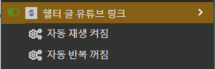

# Shelter Utils (쉘터 유틸)
쉘터를 쓰면서 유용한 유저 스크립트

> [!Warning]
> **대충 쓴 글이라 가독성이 떨어짐**

## 목차
- [Show DateTime (날자 및 시간 표시)](#show-datetime-날자-및-시간-표시)
- [Hide Right Bar (오른쪽 바 숨기기)](#hide-right-bar-오른쪽-바-숨기기)
- [Viewer Youtube Link (글 내용 유튜브 링크)](#viewer-youtube-link-글-내용-유튜브-링크)
- [Zoom In Out (줌 인 아웃)](#zoom-in-out-줌-인-아웃)

## Show DateTime (날자 및 시간 표시)

[Download][show-datetime-download] | [Source][show-datetime-source]

**쉘터 기본 시간 표시는 몇일 전, 몇시간 전, 몇분 전 이렇게 표시되어 
언제인지 정확한 시간이 표시가 안되어 불편한 부분을 스크립트로 해결**

**날자가 목록에선 이런식으로 표시되고**

**글 읽을땐 이렇게 표시되며**

**글 목록 상단에 이런식으로 페이지 버튼과 검색 버튼이 표시됩니다.**

 

## Hide Right Bar (오른쪽 바 숨기기)

[Download][hide-right-bar-download] | [Source][hide-right-bar-source]

**쉘터를 쓰면서 오른쪽 바가 불 필요하다고 느낀다면 있으면 좋은 스크립트**

> [!Note]
> 
> 
> 
> 상단 오른쪽에 생긴 ◀ or ▶ 버튼을 눌러 열고 닫을 수 있습니다.

> [!Tip]
> 해당 버튼으로 오른쪽 바가 없어져서 비어버린 양 사이드 빈 공간을 꽉 채워버립니다.
> 

>   
>   
> 

## Viewer Youtube Link (글 내용 유튜브 링크)

[Download][viewer-youtube-link-download] | [Source][viewer-youtube-link-source]

**글 내용에 유튜브 링크가 있을경우 링크 클릭시 유튜브로 이동이 아닌 글 안에 유튜브 임배드가 생성됩니다.**

> [!Tip]
> 해당 버튼들로 유튜브 임배드를 만들때 자동으로 셋팅되는 옵션을 설정할 수 있습니다. (기본값: 꺼짐)
> 

## Zoom In Out (줌 인 아웃)

[Download][zoom-in-out-download] | [Source][zoom-in-out-source]

**쉘터 글을 읽다가 안보이는 노안을 위한 스크립트**

> [!Important]
> 글자만 확대됩니다.

  
  

## LICENSE
[GNU GPL 3.0](LICENSE)

[show-datetime-download]: https://github.com/MaGyul/shelter-utils/raw/main/shelter-show-datetime.user.js
[show-datetime-source]: https://github.com/MaGyul/shelter-utils/blob/main/shelter-show-datetime.user.js
[hide-right-bar-download]: https://github.com/MaGyul/shelter-utils/raw/main/shelter-hide-right-bar.user.js
[hide-right-bar-source]: https://github.com/MaGyul/shelter-utils/blob/main/shelter-hide-right-bar.user.js
[viewer-youtube-link-download]: https://github.com/MaGyul/shelter-utils/raw/main/shelter-viewer-youtube-link.user.js
[viewer-youtube-link-source]: https://github.com/MaGyul/shelter-utils/blob/main/shelter-viewer-youtube-link.user.js
[zoom-in-out-download]: https://github.com/MaGyul/shelter-utils/raw/main/shelter-zoom-in-out.user.js
[zoom-in-out-source]: https://github.com/MaGyul/shelter-utils/blob/main/shelter-zoom-in-out.user.js
